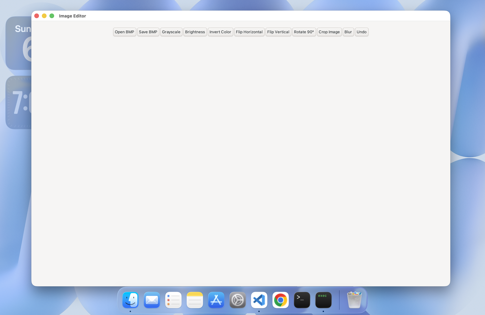
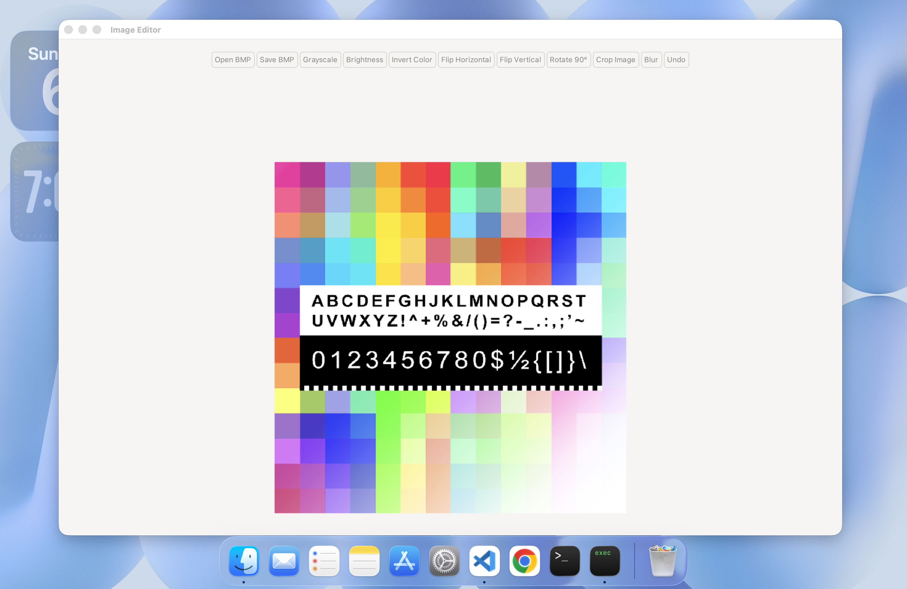
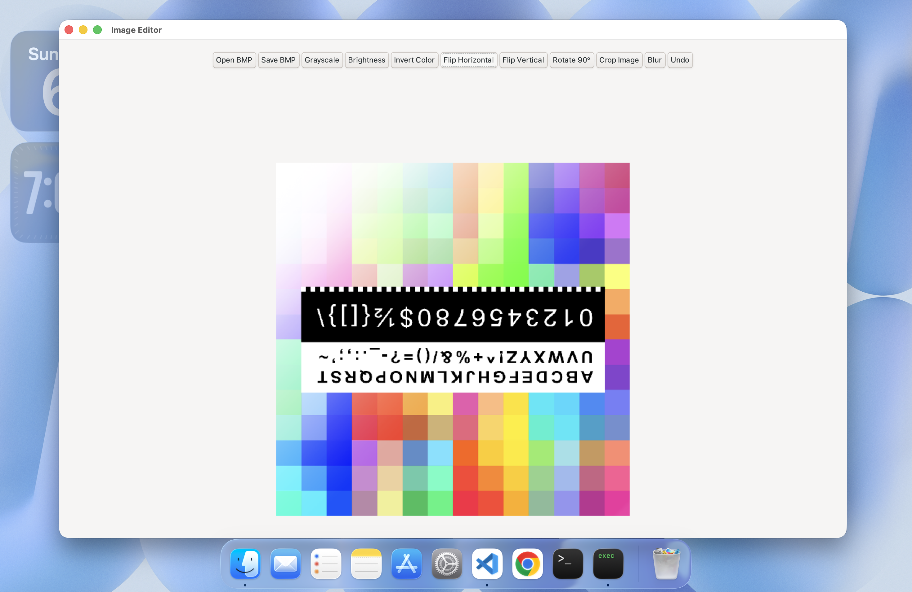

# Image_Editor

A graphical image editing software developed in C using the IUP toolkit for CSE1101L. The application allows users to open 24-bit uncompressed BMP images, apply various pixel manipulation operations, and save the modified output.

## Recommendation

It is recommended to run this project on **macOS or Linux**.

## Demonstration Video
- **Project Running Demo Video:** [https://drive.google.com/file/d/1FM1c4tPe4OaiwnnVDEEqUHUTMFZfATxB/view?usp=sharing]

## Screenshots
| Main Interface | Image Loaded | Image Processing |
| :---: | :---: | :---: |
|  |  |  |


## Features
- **Open & Save BMP**: Supports loading and saving 24-bit uncompressed `.bmp` files via IUP file dialogs.
- **Grayscale Conversion**: Converts color images to grayscale using weighted RGB intensity (0.299R + 0.587G + 0.114B).
- **Brightness Adjustment**: Adjusts image brightness with user inputs bounded between -255 and 255.
- **Invert Color**: Inverts RGB components (255 - RGB) to produce a negative effect.
- **Flip Operations**: Supports Horizontal (left-right) and Vertical (top-bottom) mirroring.
- **Rotation**: Rotates the image 90 degrees clockwise with dynamic dimension recalculation.
- **Crop Image**: Extracts user-defined rectangular regions with boundary validation.
- **Blur**: Applies a 3x3 neighborhood spatial averaging filter.
- **1-Level Undo**: Preserves previous image state for restoration.

## Required File Structure
Ensure the folder layout strictly matches the following structure so `Makefile` can locate the library dependencies:

```text
Project_Folder/
├── main.c
├── gui.c / gui.h
├── image.c / image.h
├── process.c / process.h
├── Makefile
└── iup/
    ├── include/
    │   └── (IUP header files)
    └── lib/
        ├── Mac/
        │   └── libiup.a
        └── Linux/
            └── libiup.a
```

---

## Prerequisites & Dependencies

### 1. macOS
1. **Install Homebrew** (if not already installed):
   ```bash
   /bin/bash -c "$(curl -fsSL https://raw.githubusercontent.com/Homebrew/install/HEAD/install.sh)"
   ```
2. **Install Required Build Tools & Packages**:
   ```bash
   brew install gtk+3 pkg-config gcc make
   ```

---

### 2. Linux

- **Ubuntu / Debian / Linux Mint**:
  ```bash
  sudo apt update
  sudo apt install -y build-essential libgtk-3-dev pkg-config
  ```

- **Fedora / RHEL**:
  ```bash
  sudo dnf install -y gcc make gtk3-devel pkgconfig
  ```

- **Arch Linux**:
  ```bash
  sudo pacman -S --noconfirm base-devel gtk3 pkgconf
  ```

---

## IUP Library Setup (`iup.zip`)

1. **Unzip `iup.zip`** inside your main project folder.
2. **Nested Folder Fix**: Unzipping sometimes creates a nested folder structure like `iup/iup/`. If this happens:
   - Open the inner `iup` folder, select **all files and folders inside it**, and **Cut (Ctrl+X / Cmd+X)**.
   - Go back one level to the outer `iup` folder and **Paste (Ctrl+V / Cmd+V)**.
   - Delete the remaining empty inner folder and `iup.zip`.
   - Ensure the final relative path is `iup/include` and `iup/lib`.

---

## Manual Execution Instructions

1. Download and extract the project `.zip` file manually.
2. Complete the **IUP Library Setup** step above.
3. Open your terminal and navigate into the extracted project folder:
   ```bash
   cd path/to/project_folder
   ```
4. Compile the project using `make`:
   ```bash
   make
   ```
5. Run the executable:
   ```bash
   ./Image_Editor
   ```
6. Clean up temporary build files (Optional):
   ```bash
   make clean
   ```

---
